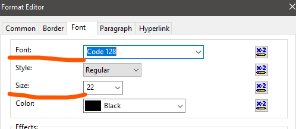
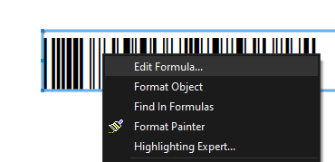
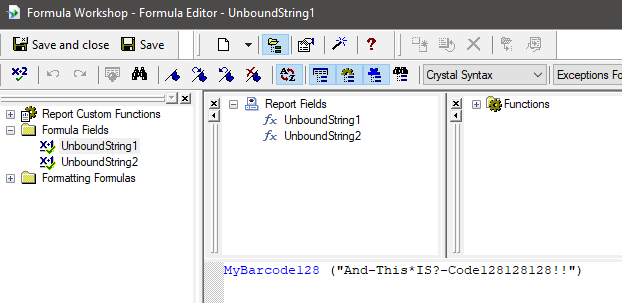

# Bar code 128 in Crystal Report

To have Code 128 barcode in report from CR you have 2 options:

1. Create or use a UFL class library - nice but you need to install additional files into CR runtime directory, and the code 128 font.
2. Use a font file and function that returns code 128 formatted string, that you can display it in text object with set font to Code 128. Much simpler, only need to instal Code128 font which is done by very simply in Win7/Win10 already (just open file and click install in font preview dialog).

I decided to go with option 2 which is much easier to implement (still re-writing code that works in CR was PITA :sweat_smile: ).

I have rewritten code from page:
https://grandzebu.net/informatique/codbar-en/code128.htm#Version which is a gold mine for barcode symbologies information.

## Pre-reqs
Download from mentioned page the font file ( look for paragraph: *The font " code128.ttf "* ). Open the downloaded font file, make sure that in window you have ```Version: 2.0``` and then click Install in  window.
(I am including the font file Code128.ttf ```v.2.0```  in case Grandzebu webpage would gone offline).

## Define functions
In Crystal Reports Formula Workshop, create new **Custom function** name it ```MyBarcode128```. Switch syntax to ```Basic syntax``` and paste into window content of the text file: [MyBarcode128.txt](MyBarcode128.txt) . 


Click ```Save and close``` - if displays an error - I can't help much, I have it working in CR 2019 (in VS extension).

## Usage
Place a text object (unbound string field), open it's properties (```Format object```).

Set Font to Code128, set the font size *(I think size about 18-32pt should result in big enough barcode but not too big for most printers)*.


Edit formula of the object.

You will see **Formula Workshop** window. 
Switch to **Crystal syntax** (I don't know why it won't work in Basic syntax :thinking: ).
Just type function name ```MyBarcode128("THE-CODE-CONTENT-")```, or drag into the parenthesis field from Fields.



Now just ```Save and close``` and you can enjoy barcodes in Code 128 on your report.

#### Preview


*(Barcode Scanner app on Android)*


## Credits
All the most important work came from Grandzebu [https://grandzebu.net/](https://grandzebu.net/). 
If you find it usefull give him a small donation for his work (you can find link to it at end of page with code description). As for me, I'll be fine if you  keep link to my repo in function comment :smile:  

# EOF